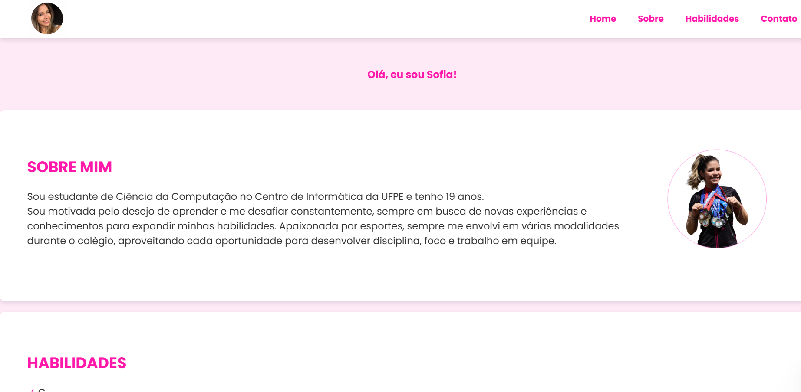

# Site Pessoal - Sofia Remides

Bem-vindo ao meu portfólio! Este site foi desenvolvido especialmente para o processo seletivo do CITi **_(maior empresa júnior de tecnologia do Brasil!!!)_**, com o objetivo de apresentar minhas habilidades, experiências e conhecimentos de forma organizada e objetiva.

### Índice
- Sobre o Projeto
- Tecnologias Utilizadas
- Como Visualizar o Portfólio
- Contato

### Sobre o Projeto
Este projeto foi criado para para concluir um desafio proposto durante o processo seletivo do CITi, destacando minha formação, habilidades e interesses pessoais. A interface foi projetada para ser intuitiva e limpa, com foco na apresentação das minhas qualificações.

### Tecnologias utilizadas:
- HTML: Estrutura da página.
- CSS: Estilização e layout responsivo.
- Flexbox: Para alinhamento dos elementos de forma organizada.
- Google Fonts: Fonte Poppins utilizada no design.

### Como visualizar o site

1. Clone o repositório para o seu dispositivo:
- **_git clone https://github.com/sofiaremides/portfolio.git_**

2. Abra o arquivo **_index.html_** em um navegador de sua preferência para visualizar o site.

### Contato
Para qualquer dúvida ou para discutir oportunidades, você pode entrar em contato comigo através das redes sociais listadas:
- LinkedIn: https://linkedin.com/in/sofiaremides 
- Instagram: https://intagram.com/sofiaremides
- GitHub: https://github.com/sofiaremides
